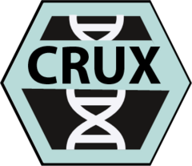

# CRUX 

<!-- badges: start -->
[](https://github.com/CCICB/CRUX/actions/workflows/R-CMD-check.yaml)
[](https://selkamand.r-universe.dev/ui#package:CRUX)
<!-- badges: end -->

## Description

A shiny app that simplifies cohort-level, tertiary cancer analysis. You can import your own data, or use public TCGA or PCAWG datasets.

> **Note** CRUX is now live at <https://ccicb.shinyapps.io/crux/>

> **Note** For analysing sensitive datasets, we reccomend installing CRUX binaries, or installing it as an R package so you can run CRUX on a system of your choice.

## Manual

A **manual** describing the installation and use of **CRUX** can be found [**here**](https://crux-docs.readthedocs.io/en/latest/index.html)

<https://readthedocs.org/projects/crux-docs/badge/?version=latest&style=plastic>

## Installation

#### OPTION 1: Use the CRUX web app

CRUX is now live at <https://ccicb.shinyapps.io/crux/>

This is the best way to quickly test out CRUX. To analyse sensitive datasets, we reccomend installing the desktop version of CRUX

#### OPTION 2: Download Desktop Version of CRUX for Windows / MAC

Download the [**latest release**](https://github.com/CCICB/CRUX/releases) and follow the instructions for your operating system.

There are **no** dependencies other than having a browser (Chrome, Firefox, Edge or Safari)

#### OPTION 3: Install as an R package (Linux / Windows / MAC)

1.  Check R \> 3.5.0 is installed (run `sessionInfo()`)

2. For some versions of R you may need to install maftools before installing CRUX
```
install.packages('BiocManager')
BiocManager::install('PoisonAlien/maftools@72208f2')
```
3.  Install CRUX by running: 
```
install.packages('CRUX', repos = c('https://ccicb.r-universe.dev', 'https://cloud.r-project.org'), dependencies = TRUE)
```
4.  Run the CRUX app: `CRUX::run_app()`

# Funding

This project was supported by grant 1165556 awarded through the 2018 Priority-driven Collaborative Cancer Research Scheme and co-funded by Cancer Australia and My Room. We would also like to acknowledge Luminesce Alliance -- Innovation for Children's Health for its contribution and support. Luminesce Alliance, is a not-for-profit cooperative joint venture between the Sydney Children's Hospitals Network, the Children's Medical Research Institute, and the Children's Cancer Institute. It has been established with the support of the NSW Government to coordinate and integrate paediatric research. Luminesce Alliance is also affiliated with the University of Sydney and the University of New South Wales Sydney.


# Acknowledgements

**Thanks to all the those who contribute to the development of CRUX**

-   Computational Biology & Bioinformatics teams at CCIA

-   Heena Sareen (extensive testing)

**As well as those who build and maintain the tools which underpin CRUX functionality**

-   Anand Mayakonda (maftools, TCGAmutations)
